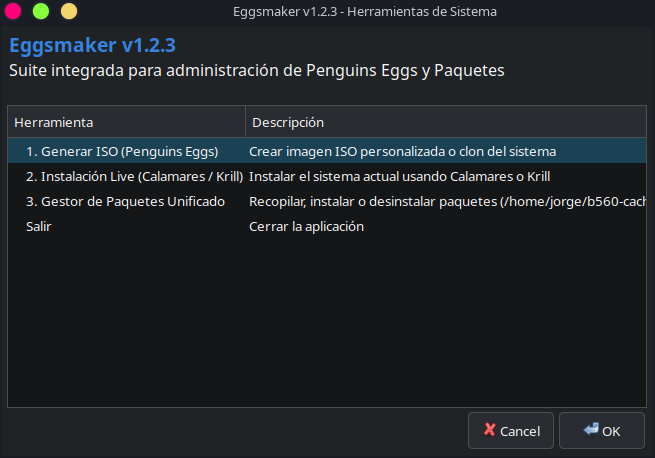
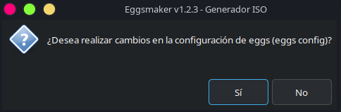
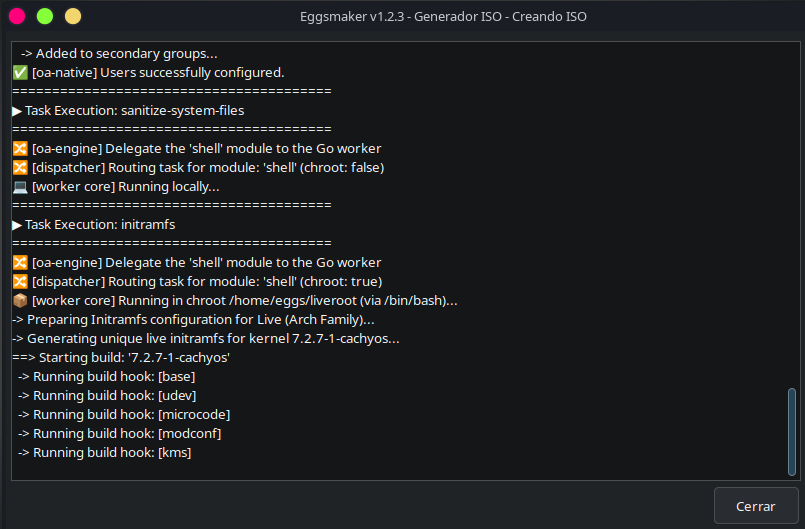
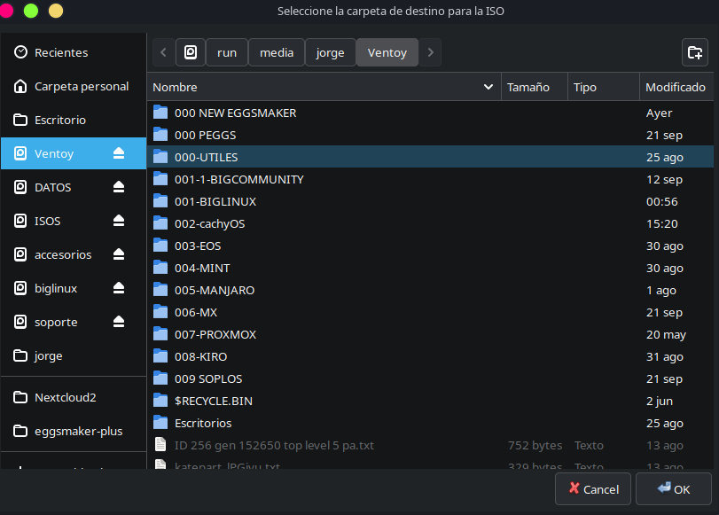

# 🥚 Eggsmaker Plus

<p align="center">
  
</p>

<p align="center">
  <strong>Custom Linux ISO creation, system cloning, and package management in one tool.</strong>
</p>

Eggsmaker Plus is a practical system tool for creating customized Linux ISOs, cloning your current installation, and managing the software installed on the machine from one interface.

[Español](#español) • [English](#english)

[](LICENSE)
[](https://www.linux.org/)
[](https://penguins-eggs.net/)

---

## Español

Durante 2025 creé Eggsmaker como una herramienta gráfica para ejecutar los comandos más útiles de Penguins Eggs. Con el paso del tiempo, la necesidad de mantenerla actualizada y adaptar cada cambio del proyecto hizo que el proceso se volviera tedioso, así que busqué una alternativa más simple y mantenible.

Así nació Eggsmaker Plus: una suite de administración del sistema pensada para facilitar la creación de ISOs personalizadas, clonar el sistema actual y gestionar aplicaciones instaladas de forma centralizada. La idea es reducir la carga de comandos manuales y dejar disponible una interfaz más práctica para tareas frecuentes.

Eggsmaker Plus está orientado a usuarios de Arch Linux y distribuciones basadas en Debian/Ubuntu que quieren trabajar más rápido sin perder control sobre el proceso. Incluye funcionalidades para generar ISOs, ejecutar instaladores como Calamares y Krill, y mantener un respaldo útil de las aplicaciones instaladas.

---

## English

Eggsmaker Plus is a graphical Bash tool designed to simplify the most common tasks used with Penguins Eggs and system maintenance on Linux. It helps create customized ISO images, clone the current system, and manage installed applications in a more practical and centralized way.

It was created to reduce manual steps, automate recurring operations, and make the process easier for users working with Arch Linux and Debian/Ubuntu-based distributions.

---

## What Eggsmaker Plus does

Eggsmaker Plus simplifies the most common tasks of Linux system maintenance with Penguins Eggs. It is designed to help you:

- generate custom ISO images from the system you are using
- clone the current installation to another machine or backup
- install and remove software in a centralized way
- launch installers such as Calamares and Krill from the same interface
- keep a practical backup of the applications currently installed

It automatically detects the Linux family and adapts the workflow for Arch-based systems and Debian/Ubuntu-based systems.

---

## Main Functions

- ISO creation: generate a customized Linux ISO using Penguins Eggs
- System cloning: create a clone of the current live installation
- Package management: back up, install, and remove packages from native, AUR, and Flatpak sources
- Installer launch: run Calamares and Krill directly from the graphical interface
- System administration: reduce repetitive terminal commands and speed up maintenance tasks
- Multi-language support: Spanish, Italian, and English interface support

---

## Key Features

- Multi-distribution support: native compatibility with Arch Linux (`pacman` / `yay`) and Debian / Ubuntu (`apt`)
- ISO generator: create standard custom ISOs or clone the current live system with `--clone`
- Direct installer execution: launches Calamares and Krill without leaving the graphical interface
- Unified package manager: backup, install, and uninstall native packages, AUR packages, and Flatpak apps in one place
- Internationalization support: automatic language detection for Spanish, Italian, and English
- Practical workflow: reduces repetitive commands and shortens system maintenance tasks

---

## Screenshots

| Main Menu | ISO Generation |
| :---: | :---: |
|  |  |

| Progress / Task Execution | Destination Selection |
| :---: | :---: |
|  |  |

---

## Installation

1. Clone the repository:

   ```bash
   git clone https://github.com/jlendres/eggsmaker-plus.git
   cd eggsmaker-plus
   ```

2. Give execution permissions to the scripts:

   ```bash
   chmod +x install.sh eggsmaker
   ```

3. Install the required dependencies:

   ```bash
   sudo ./install.sh
   ```

4. Launch the application:

   ```bash
   sudo ./eggsmaker
   ```

5. You can also launch it from the application menu after installation. When prompted, enter your sudo password to start it.

---

## Usage

Eggsmaker Plus is aimed at users who need to do the following quickly and with less effort:

- generate custom ISO images from the running system
- clone the current installation to another machine or backup
- install software that is already configured for that environment
- restore packages on another system with the same profile
- launch installers and maintenance tasks from a single interface
- avoid remembering long command lines for repetitive actions

In short, the program is useful for anyone who wants to create custom Linux images, manage installed software, and simplify common administrative tasks without losing control over the process.

---

## Project Background

The project started as a practical solution for the recurring tasks associated with Penguins Eggs and Linux system maintenance. Over time, it evolved into a more complete tool that combines ISO creation and package management in a single interface.

This project is inspired by the work of Penguins Eggs and is meant to make those workflows more accessible without sacrificing control or flexibility.

---

## License

This project is distributed under an open-source license. Please check the repository files for the exact licensing terms before redistribution or commercial reuse.

---

## Credits

- Penguins Eggs: https://penguins-eggs.net/
- YAD: https://sourceforge.net/projects/yad-dialog/

